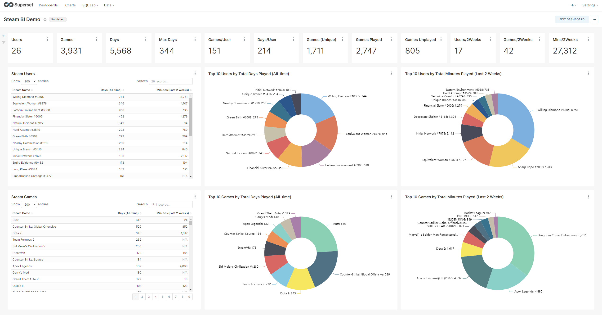
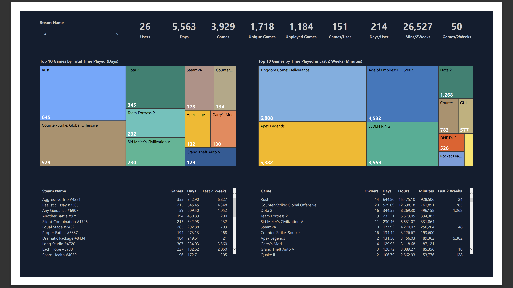

# steam_bi
- Fetch and feed data available from Steam's API to industry leading data visualization tools like [Apache Superset](https://superset.apache.org/) and [Microsoft Power BI](https://powerbi.microsoft.com/en-us/). 
- There is an older legacy version [here](https://github.com/m-e-w/steam_bi_legacy) that can be used if you're looking for a simpler option. It can generate .json files that can be loaded into Power BI dashboards.

# Table of Contents
- [Requirements](#requirements)
    - [OS & Python](#os--python)
    - [Backend Result Store](#backend-result-store)
    - [Message Broker](#message-broker)
    - [Database](#database)
    - [Visualization](#visualization)
    - [Steam](#steam)
- [Installation & Testing](#installation--testing)
- [Project Structure](#project-structure)
    - [docs](#docs)
    - [res](#res)
    - [sbi-worker](#sbi-worker)
    - [scripts](#scripts)
- [Changelog](docs/change-log.md)
- [Links](docs/links.md)

Dashboard created with Apache Superset


Dashboard created with Microsoft Power BI


# Requirements
- There are multiple different services used in the project including:
    - Superset (or Power BI)
    - MySQl
    - Redis
    - RabbitMQ
- Testing was done using docker containers for all of the above services with the exception of Power BI as there is no docker option
- In addition to the above, a linux OS with Python 3.10.6 should be used
- Testing was done with Fedora Linux 36 (Server Edition) and Python 3.10.6

## OS & Python
- Any linux OS with Python 3.10.6 or higher
- This is required to run the python worker

## Backend Result Store
- We may explore adding support for additional backends / result stores for celery but for now Redis is the only supported backend

### Redis
- You will need an intance of Redis for celery to use as the backend result store
- Testing was done using Redis running as a docker container: https://hub.docker.com/_/redis
- Version: 7.0.4

## Message Broker
- We may explore adding support for additional brokers for celery but for now RabbitMQ is the only supported broker

### RabbitMQ
- You will need an instance of RabbitMQ to use as the message broker for celery
- Testing was done using RabbitMQ running as a docker container: https://hub.docker.com/_/rabbitmq
- Version: 3.10.7

## Database
- We may explore adding support for additional databases down the road but for now MySQL is the only supported DB

### MySQL
- You will need a MySQL database to store the data retrieved from Steam's API
- A database schema script is provided in scripts/
- Testing was done using MySQL running as a docker container: https://hub.docker.com/_/mysql
- Version: 8.0.30
- You can use: https://dev.mysql.com/downloads/workbench/ to connect and execute the provided database schema script

## Visualization
- You can use any data visualization software that can connect to MySQL
- Testing was done with Apache Superset and Microsoft Power BI
- Sample Power BI dashboards are included (Apache Superset tbd pending testing importing/exporting between Superset environments)

### Superset
- You can use any Superset environment
- Testing was done using a Superset docker container stack deployed via docker-compose: https://superset.apache.org/docs/installation/installing-superset-using-docker-compose
- You will need to connect Superset to MySQL: https://superset.apache.org/docs/databases/mysql

### Power BI
- You can use Power BI desktop or Power BI Service
- Testing was done using Power BI Desktop: https://apps.microsoft.com/store/detail/power-bi-desktop/9NTXR16HNW1T?hl=en-us&gl=US
- You will need to connect Power BI to MySQL
    - Install MySQL Connector/NET 8.0.16
        - This is a direct link to the most recent version that works: https://downloads.mysql.com/archives/get/p/6/file/mysql-connector-net-8.0.16.msi
        - This is a link where you can select the version for yourself and can see the MD5 checksums and GnuPG signatures: https://downloads.mysql.com/archives/c-net/
- There is a sample dashboard in res/viz/powerbi/dashboards/
    - Open games_v2_mysql.pbit to see your data
        - You will see an error. This is normal. Go to transform -> Data Source Settings
        - From here you can change the data source to point to your MySQL DB
        - Once you're done, hit apply and your data will load

## Steam
- You will need a [Steam API Key](https://partner.steamgames.com/doc/webapi_overview/auth)
- You will need to know your steam id
    - If you use a custom steam url and you don't know your steamid, you can look it up with the following command:
        - Powershell: ```curl.exe YOUR_STEAM_PROFILE_URL | Select-String -Pattern "g_rgProfileData"```

# Installation & Testing
- Deploy (at minimum) MySQL (schmea script provided), Redis, RabbitMQ
- Install Python 3.10.6 on any modern linux OS
- run /scripts/worker-setup.sh
- rename sbi-worker/env.py.example -> env.py and fill it in with your own values
- run /scripts/worker-start.sh to start the worker
- run /scripts/worker-check.sh to check for the worker related processes to confirm they started
- run /scripts/worker-test.sh passing a steam id as an argument e.g. ./scripts/worker-test.sh some_steam_id
    - You should see something similiar to the following:
        ```
        {
        "task_id": "196584b0-93fa-4625-bba2-fd9973a6d950",
        "task_result": null,
        "task_status": "PENDING"
        }
        {
        "task_id": "196584b0-93fa-4625-bba2-fd9973a6d950",
        "task_result": null,
        "task_status": "PENDING"
        }
        {
        "task_id": "196584b0-93fa-4625-bba2-fd9973a6d950",
        "task_result": null,
        "task_status": "PENDING"
        }
        {
        "task_id": "196584b0-93fa-4625-bba2-fd9973a6d950",
        "task_result": null,
        "task_status": "PENDING"
        }
        {
        "task_id": "196584b0-93fa-4625-bba2-fd9973a6d950",
        "task_result": {
            "game": 0,
            "gameinuse": 4033,
            "user": 28
        },
        "task_status": "SUCCESS"
        }
        {
        "task_id": "196584b0-93fa-4625-bba2-fd9973a6d950",
        "task_result": {
            "game": 0,
            "gameinuse": 4033,
            "user": 28
        },
        "task_status": "SUCCESS"
        }
        ```
    - Basically, the test enqueues a task to discover all the games of the given user and the users friends. It then checks the status of the task every 3 seconds for a total of 5 times. This is completely arbitrary (in testing this task took on average 12 seconds so I just wanted it to poll long enough to see it complete)
- If you run into any issues/erors, check the celery / gunicorn logs in sbi-worker/logs
- Assuming everything worked as expected, you should see data has been written to MySQL. At this point you can connect with Superset and start building dashboards or connect with Power BI and use the example dash supplied. We are working on making a Superset dashboard available pending testing of exporting/importing.

# Project Structure

## docs
- All documentation not included directly within this README is located here

## res
- All static resources are located here. Examples include:
    - Templated dashboards for data visualization software (Power BI, Superset TBD)
    - Screenshots and other sample exports

## sbi-worker
- Python backend 'worker'. This is what does the 'heavy lifting' so to speak. All code for the worker is found here. 

### Components
- Flask
    - Flask is used to provide a responsive micro API framework so that the clients can enqueue tasks and check their status
- Celery
    - Celery is asynchronous task queue 
    - It is used because there can be a lot of requests sent to Steam's API the total # of request may vary by the # of friends a given user has or options used. This can mean some tasks may take longer to execute than others
    - In my testing, it takes about ~ 12 seconds to gather data on ~ 28 users.
- Gunicorn
    - Gunicorn is a Pyhon WSGI HTTP server
    - It is used to run Flask
- Redis (Not included)
    - Redis is the result store used by the celery worker
- RabbitMQ (Not included)
    - RabbitMQ is the message broker used by the celery worker

## scripts
- Scripts to help automate project setup / testing
- **PLEASE NOTE**: At the moment, any included bash scripts (.sh extension) should **ONLY** be run from the **ROOT** project directory as relative paths are used. e.g. ```./scripts/worker-setup.sh``` 

### create_table.sql 
- Create Database .sql script that can be used to create the required schema in MySQL

### worker-setup.sh
 - Creates a .virtual_envs directory in the current users home directory
 - Creates a new python virtual environment for the worker in that directory
 - It will then activate the environment, update pip, and install all required python packges found in sbi-worker/requirements.txt

### worker-start.sh
 - Starts all required worker processes: [celery, gunicorn(flask)] in the background 
 - Their logs can be found in sbi-worker/logs

### worker-check.sh
 - This will check to see if there are any worker related processes running (gunicorn / celery)

### worker-clear_logs.sh
 - This will clear all celery / gunicorn log files

### worker-test.sh
 - This will call a simple tests.py file to enqueue a task for the worker and check its status

### worker-stop.sh
 - This will kill all worker related processes (gunicorn / celery)
