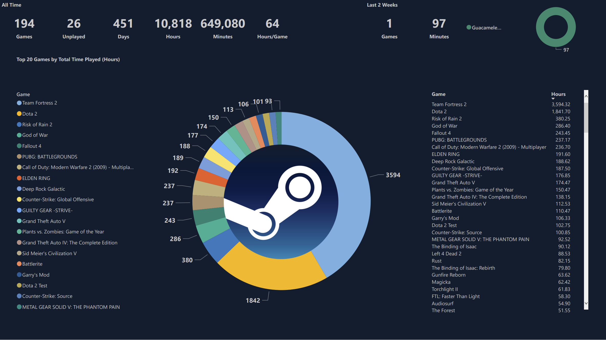
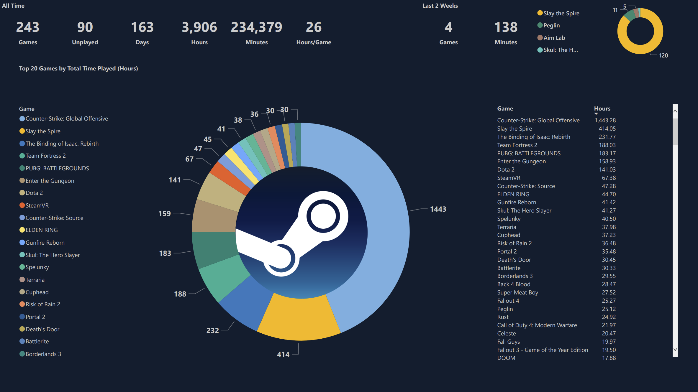
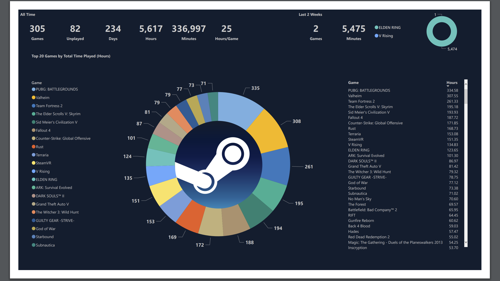

# steam_bi
Visualize Steam Data in PowerBI using Python

# Instructions
1. Install python
    - Version used: Python 3.10.3
2. Create python virtual environment
    - ```python -m venv venv```
3. Rename config.yaml.sample -> config.yaml
    - Replace steamid and key with your own values
4. Activate python virtual environment
    - If on windows: ```./venv/Scripts/activate.ps1```
5. Install dependencies
    - ```pip install -r requirements.txt```
6. Run
    - ```python starter.py```
7. Open templates/steam_bi.pbit to see your data
    - You will see an error. This is normal. Go to transform -> Data Source Settings
    - From here you can change the data source to point to the path of your data
    - Once you're done, hit apply and your data will load

- Note: You will see another file called: steam_bi_steamid_guid.json in data/
    - In order to anonymize the data, all steamids are replaced with a guid
    - This file contains the actual steamids and the guids so you can de-anonymize the data after generating
    - Each guid will be unique per steamid and are re-generated every time new data is fetched  
- Note: If you use a custom steam url and you don't know your steamid, you can look it up with the following command:
    - Powershell: ```curl.exe YOUR_STEAM_PROFILE_URL | Select-String -Pattern "g_rgProfileData"```

## Resources
- [PowerBI template](templates/steam_bi.pbit)
- [Steam API Key](https://partner.steamgames.com/doc/webapi_overview/auth)

## Screenshots



